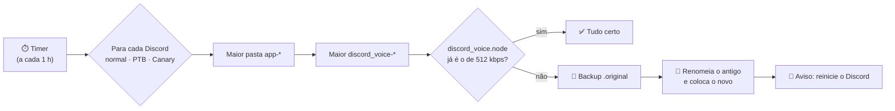

<p align="center">
  
</p>

<p align="center">
  <a href="https://github.com/Dimasaas/DiscordNodeStereo/releases/latest"></a>
  <a href="https://github.com/Dimasaas/DiscordNodeStereo/releases"></a>
  
  
  
  <a href="LICENSE"></a>
</p>

<p align="center">
  Toda atualização do Discord baixa um <code>discord_voice.node</code> novo e o seu <b>mic estéreo a 512 kbps</b> some.<br>
  O <b>DiscordNodeStereo</b> percebe sozinho e coloca o arquivo certo de volta: no Discord, no PTB e no Canary.
</p>

<p align="center">
  <a href="https://github.com/Dimasaas/DiscordNodeStereo/releases/latest/download/DiscordNodeStereo.exe">
    
  </a>
</p>

<p align="center">
  
</p>

## ✨ Destaques

<table>
  <tr>
    <td width="50%" valign="top">
      <h3>🎙️ Sempre 512 kbps em estéreo</h3>
      O <code>.node</code> com o mic estéreo a 512 kbps vai embutido no <code>.exe</code>. É sempre ele que entra no Discord.
    </td>
    <td width="50%" valign="top">
      <h3>🔎 Acha a versão mais nova</h3>
      Entra na maior pasta <code>app-*</code> e no maior <code>discord_voice-*</code>, comparando número a número (<code>1.0.10000</code> &gt; <code>1.0.9999</code>).
    </td>
  </tr>
  <tr>
    <td valign="top">
      <h3>🎧 Discord, PTB e Canary</h3>
      Verifica todos os que estiverem instalados, de uma vez, sem você escolher nada.
    </td>
    <td valign="top">
      <h3>👤 Funciona pra qualquer usuário</h3>
      Usa a pasta de quem está logado: <code>C:\Users\&lt;seu-usuário&gt;\AppData\Local</code>.
    </td>
  </tr>
  <tr>
    <td valign="top">
      <h3>🔁 Troca com o Discord aberto</h3>
      O Windows trava o <code>.node</code> em uso, mas deixa renomear: o antigo sai do caminho e o novo entra. Backup do original em <code>.original</code>.
    </td>
    <td valign="top">
      <h3>🔔 Aviso na hora</h3>
      Depois de trocar, pergunta: <b>Fechar Discord</b> (taskkill), <b>Abrir Discord</b> (reinicia) ou <b>Depois</b>.
    </td>
  </tr>
  <tr>
    <td valign="top">
      <h3>⏱️ No seu ritmo</h3>
      Verifica de 5 em 5 minutos até 1 vez por dia (padrão: a cada 1 hora). Também tem o botão <b>Verificar agora</b>.
    </td>
    <td valign="top">
      <h3>🪶 Leve e portátil</h3>
      Um <code>.exe</code> só, sem instalar nada. Liga com o Windows escondido na bandeja, com 0% de CPU parado e ~7 MB de memória em uso.
    </td>
  </tr>
</table>

## 🚀 Como usar

1. **Baixe** o [`DiscordNodeStereo.exe`](https://github.com/Dimasaas/DiscordNodeStereo/releases/latest/download/DiscordNodeStereo.exe) e coloque onde quiser (Área de Trabalho, pendrive…).
2. **Abra.** Ele verifica na hora e troca o módulo de voz onde precisar.
3. **Clique em "Abrir Discord"** no aviso. O Discord reinicia com o mic estéreo a 512 kbps. 🎙️

Daí pra frente ele fica na bandeja e cuida sozinho de cada atualização do Discord.

> [!TIP]
> O Windows 11 esconde ícones novos da bandeja. Clique na setinha **^** perto do relógio e arraste o ícone do microfone para a barra.

## ⚙️ Como funciona



Onde o arquivo mora:

```text
C:\Users\<usuário>\AppData\Local\Discord          (ou DiscordPTB / DiscordCanary)
└── app-1.0.9260                                  ← maior versão
    └── modules
        └── discord_voice-1                       ← maior módulo
            └── discord_voice
                ├── discord_voice.node            ← aqui entra o de 512 kbps estéreo
                └── discord_voice.node.original   ← backup do arquivo do Discord
```

Para comparar, ele olha primeiro o tamanho e depois o **SHA-256**. O `.node` embutido já vem com tamanho e hash calculados no build, então a verificação de hora em hora nem precisa descompactar nada.

## 🧰 Configurações

Tudo se configura pela janela. Os ajustes ficam no `DiscordNodeStereo.ini`, ao lado do `.exe`; se a pasta não deixar gravar, vão para `%APPDATA%\DiscordNodeStereo`.

| Chave | Padrão | Para que serve |
|---|---|---|
| `interval_minutes` | `60` | Intervalo entre verificações (qualquer valor a partir de 1). |
| `autostart` | `1` | Iniciar com o Windows (`HKCU\...\Run`, sem precisar de admin). |
| `tray_hint_shown` | `0` | Se o balão "continuo rodando na bandeja" já apareceu. |
| `last_version.<Discord>` | — | Última versão vista de cada Discord, para avisar quando sair uma nova. |
| `source` | *(vazio)* | Só para testes: caminho de outro `.node`. O normal é sempre o de 512 kbps embutido. |

## 🛠️ Compilando

Não precisa instalar nada: o `build.ps1` usa o compilador C# que já vem com o .NET Framework 4 do Windows.

```powershell
# o .node fica fora do repositório: ..\Standard\512kbps\discord_voice.node
.\build.ps1 -Test          # roda os testes e gera dist\DiscordNodeStereo.exe

# ou apontando para o arquivo
.\build.ps1 -Node "D:\arquivos\discord_voice.node"
```

A arte (ícone, banner e mockup) sai de `python tools/make_assets.py` (precisa do Pillow).

## 🧪 Testes

```text
Testes:
  ok    versões comparadas como número
  ok    pega a pasta app-* de maior número
  ok    substitui e guarda backup .original
  ok    não mexe quando já está certo
  ok    nova versão usa o módulo mais novo
  ok    substitui mesmo com o arquivo travado
  ok    fonte gzip embutida tem o hash certo
  ok    erros: sem Discord, sem módulo, sem origem
  ok    verifica Discord, PTB e Canary de uma vez

Todos os testes passaram.
```

O teste do "arquivo travado" carrega uma DLL de verdade para simular o Discord aberto e confere que a troca funciona mesmo assim.

## 📁 Estrutura

```text
├── src/
│   ├── Program.cs         entrada, instância única e .node embutido
│   ├── Core.cs            acha as versões e troca o arquivo (sem interface)
│   ├── MainForm.cs        janela, bandeja e timer
│   ├── RestartDialog.cs   aviso "Fechar / Abrir Discord"
│   ├── Settings.cs        .ini, log e início com o Windows
│   ├── Ui.cs              tema, ícone e painéis
│   └── app.manifest       DPI e permissões (roda sem admin)
├── tests/CoreTests.cs     testes do núcleo
├── assets/icon.ico
├── docs/                  imagens deste README
├── tools/make_assets.py   gera ícone, banner e mockup
└── build.ps1
```

## ❓ Problemas comuns

<details>
<summary><b>Não acho o ícone na bandeja</b></summary>

O Windows 11 esconde ícones novos. Clique na setinha **^** perto do relógio, ou vá em *Configurações → Personalização → Barra de tarefas → Outros ícones da bandeja* e ative o DiscordNodeStereo. Abrir o `.exe` de novo também traz a janela de volta.
</details>

<details>
<summary><b>"O Windows protegeu o computador" (SmartScreen)</b></summary>

O `.exe` não é assinado digitalmente. Clique em **Mais informações → Executar assim mesmo**.
</details>

<details>
<summary><b>"Módulo de voz ainda não baixado"</b></summary>

O Discord só baixa o módulo de voz na primeira vez que você entra num canal de voz. Entre em um e clique em **Verificar agora**.
</details>

<details>
<summary><b>Quero voltar ao arquivo original</b></summary>

Feche o DiscordNodeStereo (bandeja → **Sair**) e o Discord. Na pasta `discord_voice`, apague o `discord_voice.node` e renomeie o `discord_voice.node.original` para `discord_voice.node`.
</details>

<details>
<summary><b>Como desinstalar</b></summary>

Desmarque **Iniciar com o Windows**, clique em **Sair** na bandeja e apague o `DiscordNodeStereo.exe`, o `DiscordNodeStereo.ini` e o `DiscordNodeStereo.log`.
</details>

## ⚠️ Aviso

O DiscordNodeStereo não tem relação com o Discord. Mexer nos arquivos do cliente pode ir contra os Termos de Serviço do Discord: use por sua conta e risco.

---

<p align="center">
  <br>
  <b>DiscordNodeStereo</b><br>
  Feito com 💜 por <a href="https://github.com/Dimasaas">@Dimasaas</a> · <a href="LICENSE">Licença MIT</a>
</p>
