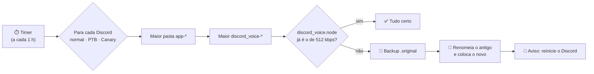

<p align="center">
  
</p>

<p align="center">
  
  
  
  
  
</p>

<p align="center">
  <b>O VoxGuard mantém o módulo de voz de 512 kbps (mic estéreo) no seu Discord.</b><br>
  Toda vez que o Discord se atualiza ele baixa um <code>discord_voice.node</code> novo e o seu some.<br>
  O VoxGuard percebe e coloca de volta sozinho.
</p>

<p align="center">
  <a href="../../releases/latest"><b>⬇️ Baixar o VoxGuard.exe</b></a>
</p>

---

<p align="center">
  
</p>

## ✨ O que ele faz

| | |
|---|---|
| 🔎 **Acha a versão mais nova sozinho** | Entra na maior pasta `app-*` e no maior `discord_voice-*`, comparando número a número (`1.0.10000` > `1.0.9999`). |
| 🎧 **Discord, PTB e Canary** | Verifica e instala em todos os que estiverem instalados, ao mesmo tempo. |
| 👤 **Qualquer usuário do Windows** | Usa o `%LOCALAPPDATA%` de quem está logado: `C:\Users\<seu-usuário>\AppData\Local`. |
| 🔁 **Troca com o Discord aberto** | O Windows trava o `.node` em uso, mas deixa renomear: o antigo sai do caminho e o novo entra. |
| 💾 **Backup automático** | Antes da primeira troca guarda o original como `discord_voice.node.original`. |
| 🔔 **Aviso com botões** | Depois de substituir: **Fechar Discord** (taskkill), **Abrir Discord** (reinicia) ou **Depois**. |
| ⏱️ **Você escolhe o intervalo** | De 5 minutos a 24 horas (padrão: 1 hora), e tem o botão **Verificar agora**. |
| 🚀 **Liga com o Windows** | Começa escondido na bandeja, perto do relógio. |
| 📦 **Um `.exe` só** | O `.node` de 512 kbps vai embutido e compactado. Não precisa instalar Python nem nada. |
| 🪶 **Leve** | Parado entre as verificações (0% de CPU); depois de cada checagem devolve a memória ao Windows (~7 MB em uso). |

## 🚀 Como usar

1. Baixe o **[VoxGuard.exe](../../releases/latest)**.
2. Coloque onde quiser (Área de Trabalho, pendrive…). Ele é portátil: `VoxGuard.ini` e `VoxGuard.log` ficam ao lado do `.exe`.
3. Abra. Ele já verifica na hora e, se precisar, troca o módulo.
4. Quando aparecer o aviso, clique em **Abrir Discord**. O Discord reinicia com o áudio de 512 kbps em estéreo de volta. 🎙️

> [!TIP]
> O Windows 11 esconde ícones novos da bandeja. Clique na setinha **^** perto do relógio e arraste o VoxGuard para a barra.

## ⚙️ Como funciona



Onde o arquivo mora:

```text
C:\Users\<usuário>\AppData\Local\Discord          (ou DiscordPTB / DiscordCanary)
└── app-1.0.9260                                  ← maior versão
    └── modules
        └── discord_voice-1                       ← maior módulo
            └── discord_voice
                ├── discord_voice.node            ← o VoxGuard coloca o de 512 kbps aqui
                └── discord_voice.node.original   ← backup do arquivo do Discord
```

Para comparar, ele olha primeiro o tamanho e depois o **SHA-256**. O `.node` embutido já vem com tamanho e hash calculados no build, então a verificação de hora em hora nem precisa descompactar nada.

## 🧰 Configurações

Tudo pela janela. Se quiser mexer à mão, fica no `VoxGuard.ini` (ao lado do `.exe`; se a pasta não deixar gravar, vai para `%APPDATA%\VoxGuard`).

| Chave | Padrão | Para que serve |
|---|---|---|
| `interval_minutes` | `60` | Intervalo entre verificações (qualquer valor a partir de 1). |
| `autostart` | `1` | Iniciar com o Windows (`HKCU\...\Run`, sem precisar de admin). |
| `tray_hint_shown` | `0` | Se o balão "continuo rodando na bandeja" já apareceu. |
| `last_version.<Discord>` | — | Última versão vista de cada Discord, para avisar quando surgir uma nova. |
| `source` | *(vazio)* | Só para testes: caminho de outro `.node`. O normal é sempre o de 512 kbps embutido. |

## 🛠️ Compilando

Não precisa instalar nada: o `build.ps1` usa o compilador C# que já vem com o .NET Framework 4 do Windows.

```powershell
# o .node fica fora do repositório: ..\Standard\512kbps\discord_voice.node
.\build.ps1 -Test          # roda os testes e gera dist\VoxGuard.exe

# ou apontando para o arquivo
.\build.ps1 -Node "D:\arquivos\discord_voice.node"
```

A arte (ícone, banner e mockup) é gerada por `python tools/make_assets.py` (precisa do Pillow).

## 🧪 Testes

```text
Testes:
  ok    versões comparadas como número
  ok    pega a pasta app-* de maior número
  ok    substitui e guarda backup .original
  ok    não mexe quando já está certo
  ok    nova versão usa o módulo mais novo
  ok    substitui mesmo com o arquivo travado
  ok    fonte gzip embutida tem o hash certo
  ok    erros: sem Discord, sem módulo, sem origem
  ok    verifica Discord, PTB e Canary de uma vez

Todos os testes passaram.
```

O teste do "arquivo travado" carrega uma DLL de verdade para simular o Discord aberto e confere que a troca funciona mesmo assim.

## 📁 Estrutura

```text
├── src/
│   ├── Program.cs         entrada, instância única e .node embutido
│   ├── Core.cs            acha as versões e troca o arquivo (sem interface)
│   ├── MainForm.cs        janela, bandeja e timer
│   ├── RestartDialog.cs   aviso "Fechar / Abrir Discord"
│   ├── Settings.cs        VoxGuard.ini, log e início com o Windows
│   ├── Ui.cs              tema, ícone e painéis
│   └── app.manifest       DPI e permissões (roda sem admin)
├── tests/CoreTests.cs     testes do núcleo
├── assets/icon.ico
├── docs/                  imagens deste README
├── tools/make_assets.py   gera ícone, banner e mockup
└── build.ps1
```

## ❓ Problemas comuns

<details>
<summary><b>Não acho o ícone na bandeja</b></summary>

O Windows 11 esconde ícones novos. Clique na setinha **^** perto do relógio, ou vá em *Configurações → Personalização → Barra de tarefas → Outros ícones da bandeja* e ative o VoxGuard. Abrir o `.exe` de novo também traz a janela de volta.
</details>

<details>
<summary><b>"O Windows protegeu o computador" (SmartScreen)</b></summary>

O `.exe` não é assinado digitalmente. Clique em **Mais informações → Executar assim mesmo**.
</details>

<details>
<summary><b>"Módulo de voz ainda não baixado"</b></summary>

O Discord só baixa o módulo de voz na primeira vez que você entra num canal de voz. Entre em um e clique em **Verificar agora**.
</details>

<details>
<summary><b>Quero voltar ao arquivo original</b></summary>

Feche o VoxGuard (bandeja → **Sair**) e o Discord. Na pasta `discord_voice`, apague o `discord_voice.node` e renomeie o `discord_voice.node.original` para `discord_voice.node`.
</details>

<details>
<summary><b>Como desinstalar</b></summary>

Desmarque **Iniciar com o Windows**, clique em **Sair** na bandeja e apague o `VoxGuard.exe`, o `VoxGuard.ini` e o `VoxGuard.log`.
</details>

## ⚠️ Aviso

O VoxGuard não tem relação com o Discord. Mexer nos arquivos do cliente pode ir contra os Termos de Serviço do Discord: use por sua conta e risco.

---

<p align="center">
  <br>
  Feito com 💜 por <a href="https://github.com/Dimasaas">@Dimasaas</a> · <a href="LICENSE">Licença MIT</a>
</p>
